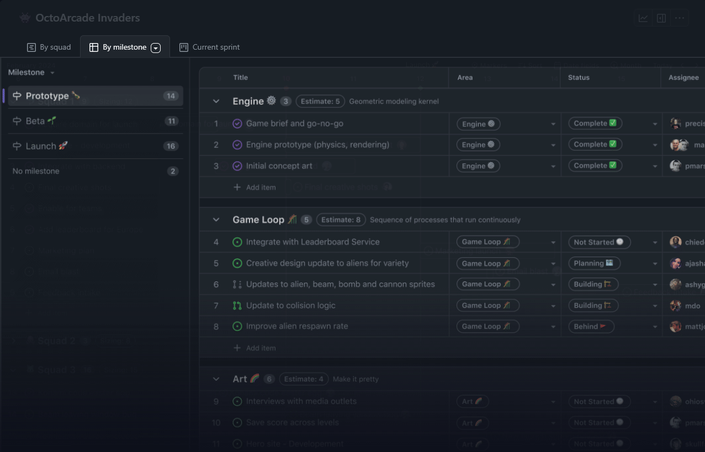

<h1>questoes-da-prova2</h1>


## Sumário

* [Introdução ao GitHub](#introdução-ao-github)
  * [O que é GitHub?](#o-que-é-github)
  * [História e evolução do GitHub](#história-e-evolução-do-github)
  * [Principais funcionalidades e benefícios](#principais-funcionalidades-e-benefícios)
* [Configuração Inicial](#configuração-inicial)
  * [Criando uma conta no GitHub:](#criando-uma-conta-no-github)
  * [Instalando o Git e configurando no GitHub:](#instalando-o-git-e-configurando-no-github)
  * [Primeiros passos: criando e clonando repositórios:](#primeiros-passos-criando-e-clonando-repositórios)
* [Comandos Básicos do Git](#comandos-básicos-do-git)
  * [Estrutura de um Repositório Git](#estrutura-de-um-repositório-git)
  * [Iniciando um Repositório](#iniciando-um-repositório)
  * [Principais Comandos](#principais-comandos)
  * [Gerenciamento de Branches](#gerenciamento-de-branches)
* [Trabalho Colaborativo](#trabalho-colaborativo)
  * [Clonando e forkeando repositórios](#clonando-e-forkeando-repositórios)
  * [Pull requests: como criar e gerenciar](#pull-requests-como-criar-e-gerenciar)
  * [Revisão de código e merge de pull requests](#revisão-de-código-e-merge-de-pull-requests)
  * [Resolvendo conflitos](#resolvendo-conflitos)
* [Funcionalidades Avançadas](#funcionalidades-avançadas)
  * [GitHub Actions: automatizando fluxos de trabalho](#github-actions-automatizando-fluxos-de-trabalho)
  * [Issues e Projects: gerenciamento de tarefas e projetos](#issues-e-projects-gerenciamento-de-tarefas-e-projetos)
  * [GitHub Pages: criando sites estáticos com GitHub](#github-pages-criando-sites-estáticos-com-github)
  * [Integrações e APIs](#integrações-e-apis)
* [Boas Práticas e Dicas](#boas-práticas-e-dicas)
  * [Escrevendo bons commits e mensagens](#escrevendo-bons-commits-e-mensagens)
  * [Estrutura organizacional de repositórios](#estrutura-organizacional-de-repositórios)
  * [Segurança e permissões](#segurança-e-permissões)
  * [Uso de templates e arquivos de configuração (`.gitignore`, `README.md`)](#uso-de-templates-e-arquivos-de-configuração-gitignore-readmemd)


# Introdução ao GitHub

### O que é GitHub?

O GitHub é uma plataforma de hospedagem de código-fonte e arquivos com controle de versão usando o Git. Ele permite que programadores, utilitários ou qualquer usuário cadastrado na plataforma contribuam em projetos privados e/ou Open Source de qualquer lugar do mundo.  
Em resumo, o GitHub é um serviço baseado em nuvem que hospeda um sistema de controle de versão chamado Git. Isso significa que os desenvolvedores podem colaborar e fazer mudanças em projetos compartilhados enquanto mantêm um registro detalhado do progresso.

### História e evolução do GitHub
O **GitHub** foi desenvolvido por Chris Wanstrath, J. Hyett, Tom Preston-Werner e Scott Chacon usando Ruby on Rails e começou em fevereiro de 2008. A empresa, _GitHub, Inc._, existe desde 2007 e está localizada em São Francisco.  
Desde então, o GitHub se tornou uma plataforma essencial para colaboração e hospedagem de código-fonte com controle de versão usando o **Git**. Ele permite que programadores, utilitários ou qualquer usuário cadastrado na plataforma contribuam em projetos privados e/ou **Open Source** de qualquer lugar do mundo.  
Além disso, o GitHub é amplamente utilizado por programadores para divulgação de seus trabalhos ou para que outros programadores contribuam com o projeto. Ele promove fácil comunicação através de recursos como relatórios de problemas e solicitações de pull. Atualmente, o GitHub abriga mais de **100 milhões de projetos**, incluindo alguns conhecidos mundialmente, como WordPress, GNU/Linux, Atom e Electron.


### Principais funcionalidades e benefícios
- **Controle de Versão Distribuído**: Construído sobre o Git, o GitHub permite rastrear mudanças no código, reverter para versões anteriores e colaborar eficientemente.  
- **Hospedagem de Repositórios**: Você pode criar repositórios públicos ou privados para armazenar seu código-fonte e facilitar o compartilhamento e a colaboração.  
- **Colaboração**: Múltiplas pessoas podem trabalhar juntas em um projeto, criando ramificações para desenvolver recursos separadamente e mesclando-os quando prontos.  
- **Relatórios de Problemas e Solicitações de Pull**: Usuários podem relatar problemas e enviar solicitações de pull para propor alterações no código.
- Integração com Ferramentas: O GitHub se integra a várias ferramentas de desenvolvimento.  
- **GitHub Pages**: Permite hospedar sites estáticos diretamente de seus repositórios.

# Configuração Inicial

### Criando uma conta no GitHub:

  1. Acesse o site do [GitHub](https://github.com/).
  2. Clique em “Sign up” (ou “Inscreva-se”) e siga as instruções para criar sua conta.
  3. Verifique seu e-mail para confirmar o cadastro[^2].

### Instalando o Git e configurando no GitHub:
 - Instale o Git em seu computador. Você pode baixá-lo em [git-scm.com](https://git-scm.com/).
 - Abra o terminal (ou prompt de comando) e configure seu nome de usuário e e-mail globalmente com os seguintes comandos:

```powershell
$ git config --global user.name "Seu Nome"
```
```powershell
$ git config --global user.email "seu@email.com"
```

### Primeiros passos: criando e clonando repositórios:

- Crie um novo repositório no GitHub clicando em “New” (ou “Novo”).  
- Dê um nome ao repositório, escolha a visibilidade (público ou privado) e clique em “Create repository” (ou “Criar repositório”)[^1].  

- Para clonar um repositório existente, copie o link do repositório no GitHub e execute o seguinte comando no terminal:
```console
$ git clone <link-do-repositório>
```
# Comandos Básicos do Git

### Estrutura de um Repositório Git

Um repositório Git é uma estrutura que armazena seu código-fonte e histórico de versões. Ele consiste em três áreas principais:
- **Diretório de Trabalho *(Working Directory)***: É onde você edita e cria arquivos do seu projeto os arquivos aqui não estão rastreados pelo Git.

- **Índice *(Staging Area)***: Também conhecido como área de preparação, aqui você seleciona quais mudanças deseja incluir no próximo commit e os arquivos adicionados ao índice estão prontos para serem confirmados.

- **Histórico de Commits *(Branches)***: O Git mantém um histórico de todas as versões do seu projeto, cada commit representa um estado específico do código e os commits formam uma sequência linear ou ramificada (branches).

### Iniciando um Repositório

- Instale o Git:
Baixe e instale o Git em seu computador

- Configuração Inicial: Configure seu nome de usuário e endereço de e-mail globalmente:
```powershell
$ git config --global user.name "Seu Nome"
```
```powershell
$ git config --global user.email "seu@email.com"
```
- Crie um Repositório: Navegue até o diretório do seu projeto usando o terminal e execute o comando git init para iniciar o rastreamento do repositório:
```powershell
$ git init
```
- Adicione Arquivos ao Índice: Use `git add <arquivo>` para incluir arquivos no índice ou `git add .` para incluir todos arquivos:
```powershell
$ git add arquivo1.txt
```
```powershell
$ git add .
```
- Crie um Commit:
```powershell
$ git commit -m "Mensagem descritiva"
```
### Principais Comandos
- `git init`: É o responsável por iniciar um repositório Git no projeto, criando a pasta **.git**, que vai guardar as informações sobre as mudanças no código
- `git add <arquivo>`: Adiciona os arquivos à area de preparação (staging) para o commit, ou seja, informa ao git quais arquivos devem ser incluidos no próximo commit[^4].
- `git commit`: Grava todas as alterações dos arquivos adicionados no comando anterior ao repositório, criando um novo "ponto na história" do projeto[^5].
- `git push`: Envia suas mudanças para um repositório remoto (como o GitHub).
- `git pull`: Atualiza seu repositório local com as mudanças do repositório remoto.
- `git branch`: Lista, cria ou exclui branches (ramificações) no seu projeto.

### Gerenciamento de Branches
Use branches para desenvolver recursos separadamente e mesclá-los quando prontos.
- Crie uma nova branch com `git branch <nome-da-branch>`.
- Alterne para uma branch com `git checkout <nome-da-branch>`.
- Mescle branches com `git merge <nome-da-outra-branch>`.

# Trabalho Colaborativo

### Clonando e forkeando repositórios
**Clonar _(clone)_**: Cria uma cópia local do repositório do GitHub no seu computador e permite a contribuição direta a um projeto.  
```console
$ git clone <link-do-projeto>
```
**Forkear *(Fork)***: Cria uma cópia do repositório na sua conta do GitHub e possibilita a criação de novas funcionalidades sem afetar o projeto original, ramificando o projeto.
- No GitHub, clique no botão "Fork" na página do repositório  


### Pull requests: como criar e gerenciar
- Criando Pull Request:
  1. Faça alterações desejadas no seu repositório.
  2. Envie as alterações para o GitHub:
      ```powershell
      $ git add .
      $ git commit -m "Descrição das suas alterações"
      $ git push origin <nome-da-branch>
      ```
  3. Na página principal do repositório no GitHub, escolha a branch que contém os seus commits e clique no botão "Compare & pull request" na faixa amarela que aparecerá acima dos arquivos.
  
  4. Adicione um título e uma descrição e clique em "Create Pull Request"[^3]  

- Gerenciando Pull Requests: Após o pull request, podem ser feitas revisões por outros desenvolvedores, que adicionarão comentários e sugestões. Se necessário, é possível fazer novas alterações no código enviá-lo (usando `git push`) para atualizar o Pull Request

### Revisão de código e merge de pull requests
- **Revisão de Código**: Como parte do gerenciamento das Pull Request nos seus projetos, a revisão de código vai garantir que a alteração do código do seu projeto manterá a qualidade e estilo de código já presente anteriormente, assim como assegurar que, mesmo com as alterações, o código ainda funcionará corretamente.

- **Merge**: Após a revisão e a aprovação, o Pull Request pode ser incorporado ao projeto principal. Geralmente, o dono do repositório realiza o merge no GitHub.

### Resolvendo conflitos
Conflitos acontecem quando duas pessoas alteram a mesma linha de código.
- Como resolver[^6]:
  1. O Git indicará os arquivos com conflito
  2. Abra o arquivo e analise as marcações conflito, da seguinte forma:
      ```powershell
      <<<<<<< HEAD
      Conteúdo que está na sua versão atual do arquivo (HEAD).
      =======
      Versão do outro desenvolvedor, vinda da branch especificada.
      >>>>>>> nome-da-branch-do-outro-desenvolvedor
      ```
  3. Edite o arquivo, escolhendo a versão correta ou mesclando as alterações manualmente.
  4. Salve o arquivo, adicione as alterações (`git add .`) e faça um novo commit.

# Funcionalidades Avançadas

### GitHub Actions: automatizando fluxos de trabalho
Com GitHub Actions[^7], é possível criar fluxos de trabalho personalizados que são acionados por eventos no repositório, como:

* **Testar o código** a cada novo commit.
* **Gerar builds** e implantá-los em um servidor.
* **Enviar notificações** ao time sobre eventos importantes.
* **Automatizar publicações** em plataformas externas.

**Criando um Fluxo de Trabalho:**

* Crie um arquivo YAML na pasta `.github/workflows` do repositório, definindo os gatilhos (triggers), tarefas (jobs) e ações (actions) do seu fluxo de trabalho. 
* O GitHub também oferece uma biblioteca de ações prontas para usar e também permite a criação de ações personalizadas para o projeto.  
**Exemplo (Teste Automatizado):**
  ```yaml
  name: Testes Automáticos
  on: [push]
  jobs:
    testar:
      runs-on: ubuntu-latest
      steps:
        - uses: actions/checkout@v4
        - name: Instalar Dependências
          run: npm install
        - name: Executar Testes
          run: npm test
  ```

### Issues e Projects: gerenciamento de tarefas e projetos

* **Issues:** Crie "cartões" para rastrear bugs, novas funcionalidades ou qualquer tarefa[^8].
    * Adicione descrições detalhadas, atribua responsáveis, defina milestones e acompanhe o progresso.
* **Projects**: Organize as Issues em quadros Kanban ou gráfico de Gantt para visualizar o fluxo de trabalho. 
    * Crie colunas personalizadas (ex: "A Fazer", "Em Andamento", "Concluído") e mova as Issues entre elas.  


### GitHub Pages: criando sites estáticos com GitHub
Transforme o repositório em um site estático hospedado no GitHub em alguns cliques[^9]:
1. Crie um repositório público chamado <nome_de_usuario>.github.io
2. Clone o repositório localmente, altere e faça o push.
  ```powershell
  $ git clone https://github.com/<nome_de_usuario>/<nome_de_usuario>.github.io
  $ cd <nome_de_usuario>.github.io
  $ echo "Hello World" > index.html
  $ git add --all
  $ git commit -m "Initial commit"
  $ git push -u origin main
  ```
3. Acesse o endereço `<nome_de_usuario>.github.io` para visualizar o site online.
* Ideal para hospedar a documentação, portifólio, landing pages e projetos simples
* Integração com Jekyll e outros geradores possibilita a criação de sites mais complexos e com layouts personalizados.
* Use um domínio próprio:[^11] basta criar um arquivo chamado `CNAME`, contendo apenas o domínio adquirido[^10].

### Integrações e APIs

* **APIs:** Acesse dados do GitHub, automatize tarefas complexas e crie integrações personalizadas.
* **GitHub Marketplace:**  Encontre e utilize apps prontos para diversas funcionalidades, como CI/CD, monitoramento, segurança e muito mais.
* **Webhooks:** Configure notificações automáticas para eventos no seu repositório, enviando dados para outras plataformas.


# Boas Práticas e Dicas

### Escrevendo bons commits e mensagens
Faça commits apenas em códigos completos e bem testados e procure fazer pequenos commits, agrupando alterações relacionadas, descreva claramente seus commits pois seu log de confirmações deve contar uma história. Esforce-se para escrever mensagens que retratem de forma concisa o que cada alteração significa.

### Estrutura organizacional de repositórios
A organização de repositórios no GitHub é crucial para garantir a eficiência, a colaboração e a manutenção de projetos de software. Uma estrutura bem definida facilita a navegação, a gestão de permissões e a colaboração entre membros da equipe. Existem diferentes abordagens para organizar os repositórios, cada uma com suas vantagens e desvantagens.

Os repositórios monolíticos contêm todo o código-fonte em um único lugar, o que simplifica o gerenciamento de dependências internas e facilita a integração contínua e o deploy contínuo (CI/CD). No entanto, podem se tornar difíceis de gerenciar à medida que crescem, e o tempo de build pode ser mais longo. Já os repositórios multi-repo dividem o projeto em várias partes menores, cada uma responsável por um componente ou serviço específico. Isso facilita a modularidade e a reutilização de componentes, melhora a escalabilidade e a gestão de equipes, mas pode complicar o gerenciamento de dependências e exigir um sistema robusto de integração.

Dentro de cada repositório, a organização dos diretórios é essencial. A pasta src geralmente contém o código-fonte principal do projeto, lib abriga bibliotecas e dependências internas, e bin é destinada a arquivos binários e executáveis. A documentação do projeto deve ser colocada em uma pasta docs, enquanto arquivos como README.md e CONTRIBUTING.md fornecem informações importantes sobre o projeto e orientações para contribuidores. Arquivos de configuração devem ser armazenados na pasta config, e scripts de automação na pasta scripts.

A gestão de permissões e colaboração é outro aspecto fundamental. O GitHub permite definir diferentes níveis de acesso, desde permissões totais (Owner) até apenas leitura (Read). A criação de equipes com base em funções, como desenvolvedores, revisores de código e QA, e a definição clara de responsabilidades e permissões, facilitam a colaboração. Ferramentas como Issues e Project Boards ajudam a gerenciar tarefas e acompanhar o progresso.

A automação e integração contínua podem ser implementadas utilizando GitHub Actions para configurar pipelines de CI/CD e criar workflows automatizados para testes, builds e deploys. Webhooks também podem ser configurados para integrar o GitHub com outras ferramentas de desenvolvimento e monitoramento.

Por fim, boas práticas de manutenção são essenciais. Utilizar Git tags para marcar versões estáveis do projeto e adotar uma convenção de versionamento semântico ajudam a manter o controle das versões. Arquivar repositórios que não são mais ativos e revisar regularmente as branches obsoletas são práticas recomendadas para manter a organização.

### Segurança e permissões

A segurança e a gestão de permissões no GitHub são aspectos cruciais para proteger projetos e garantir que apenas indivíduos autorizados possam realizar determinadas ações. Uma configuração bem planejada de segurança e permissões ajuda a mitigar riscos, proteger informações sensíveis e manter a integridade do código.

### Controle de Acesso e Permissões
No GitHub, é possível definir diferentes níveis de acesso para colaboradores de um repositório, cada um com permissões específicas:

Owner:Tem controle total sobre o repositório, incluindo a capacidade de alterar configurações, gerenciar permissões e excluir o repositório. Normalmente, apenas os administradores principais ou os responsáveis pelo projeto devem ter esse nível de acesso.

Admin: Pode realizar muitas das mesmas ações que um Owner, exceto modificar as permissões de outros Owners. Ideal para gerentes de projeto e líderes técnicos que precisam de um alto nível de controle.

Write: Permite criar, modificar e excluir branches e commits, além de gerenciar issues e pull requests. Esse nível de acesso é geralmente atribuído a desenvolvedores que trabalham ativamente no projeto.

Read: Oferece acesso apenas para visualizar o código, issues e pull requests. Esse nível é útil para membros que precisam revisar o projeto sem fazer alterações diretas. 

## Práticas Recomendadas de Segurança Para garantir a segurança do repositório e das informações armazenadas, é fundamental seguir algumas práticas recomendadas:

* Autenticação de Dois Fatores (2FA):Habilitar a autenticação de dois fatores para todos os colaboradores aumenta significativamente a segurança das contas, reduzindo o risco de acesso não autorizado.

* Revisão de Código: Implementar um processo rigoroso de revisão de código, exigindo que todas as alterações sejam revisadas e aprovadas por pelo menos um outro desenvolvedor antes de serem integradas ao branch principal. Isso ajuda a identificar e corrigir potenciais vulnerabilidades antes que o código seja implantado.

* Branches Protegidos: Configurar branches protegidos para evitar que mudanças não revisadas sejam incorporadas ao branch principal. É possível exigir que todas as alterações passem por uma revisão de pull request e que todos os testes automatizados sejam executados com sucesso.
 
* Gerenciamento de Secrets: Utilizar GitHub Secrets para armazenar informações sensíveis, como tokens de API, chaves de acesso e senhas. Essas informações são criptografadas e só podem ser usadas em workflows do GitHub Actions.
 
* Auditoria e Monitoramento:Monitorar regularmente as atividades do repositório utilizando as funcionalidades de logs e auditoria do GitHub. Isso permite identificar comportamentos suspeitos ou não autorizados e responder rapidamente a incidentes de segurança.

* Políticas de Segurança:Criar e manter uma política de segurança clara e acessível para todos os membros do projeto. Essa política deve incluir diretrizes sobre como relatar vulnerabilidades, como responder a incidentes de segurança e as melhores práticas de segurança para o desenvolvimento de software.
  
## Gestão de Permissões em Equipes
A organização de equipes dentro do GitHub é uma prática eficiente para gerenciar permissões de forma centralizada:

* Criação de Equipes: Agrupar colaboradores em equipes baseadas em suas funções (ex.: desenvolvedores, revisores de código, QA) facilita a atribuição de permissões de forma consistente.
Permissões Granulares: Atribuir permissões específicas a cada equipe de acordo com suas responsabilidades. Por exemplo, a equipe de QA pode ter permissões de leitura, enquanto os desenvolvedores têm permissões de escrita.

* Integração com Ferramentas Externas: Utilizar integrações com ferramentas de gestão de identidade e acesso (IAM) para automatizar o gerenciamento de permissões e garantir conformidade com as políticas de segurança da organização.


### Uso de templates e arquivos de configuração (`.gitignore`, `README.md`)
* **`.gitignore`:**  Liste os arquivos e pastas que você **não** quer que o Git rastreie, como arquivos de sistema operacional, logs, pastas temporárias, etc.
* **`README.md`:**  Crie um arquivo README claro e informativo na raiz do seu projeto, contendo (se aplicável):
    * Título do projeto e breve descrição.
    * Instruções de instalação e uso.
    * Tecnologias utilizadas.
    * Como contribuir para o projeto.
* **Templates de Issues e Pull Requests:** Padronize a criação de Issues e Pull Requests utilizando templates. Isso garante informações essenciais e facilita a triagem e o tratamento das solicitações.


[^1]: [Criando um repositório](https://github.blog/developer-skills/github/beginners-guide-to-github-uploading-files-and-folders-to-github/ )  
[^2]: [Criar uma conta no github](https://docs.github.com/pt/get-started/start-your-journey/creating-an-account-on-github )  
[^3]: [Criando um pull request](https://docs.github.com/pt/pull-requests/collaborating-with-pull-requests/proposing-changes-to-your-work-with-pull-requests/creating-a-pull-request)  
[^4]: [Git add](https://www.atlassian.com/git/tutorials/saving-changes)  
[^5]: [Git commit](https://git-scm.com/docs/git-commit/pt_BR  )  
[^6]: [Conflitos](https://www.atlassian.com/git/tutorials/using-branches/merge-conflicts)  
[^7]: [Actions](https://docs.github.com/en/actions/automating-builds-and-tests/building-and-testing-nodejs )  
[^8]: [Issues](https://github.com/features/issues )  
[^9]: [Pages](https://pages.github.com/ )  
[^10]: [Pages custom domain 1](https://hossainkhan.medium.com/using-custom-domain-for-github-pages-86b303d3918a )  
[^11]: [Pages custom domain 2](https://docs.github.com/pt/enterprise-cloud@latest/pages/configuring-a-custom-domain-for-your-github-pages-site/managing-a-custom-domain-for-your-github-pages-site )  
