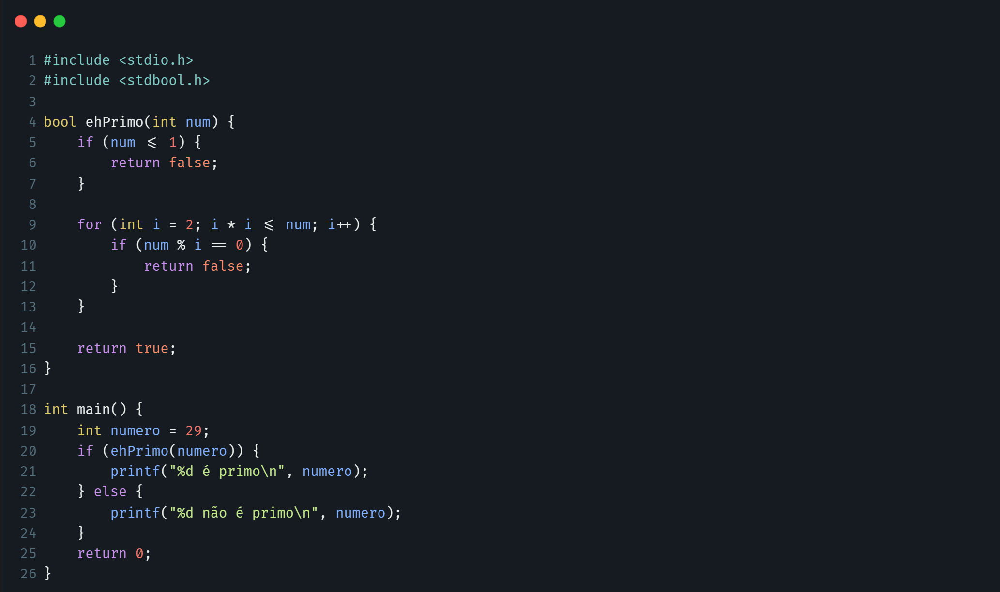

Considere trecho de código em C que implementa uma função para verificar se um número é primo:

<ol type="a">
    <li><b>Grafo de Fluxo de Controle para o algorítmo:</b></li>
    

        <picture>
            <source media="(prefers-color-scheme: dark)" srcset="img/q2-a_dark-graph-wide.png">
            <source media="(prefers-color-scheme: light)" srcset="img/q2-a_light-graph-wide.png">
            
        </picture>
    

     
     
    <li><b>Caminhos Independentes:</b></li>
    Existem 3 caminhos independentes, ou seja, 3 caminhos que passam por pelo menos uma das arestas que o outro caminho não passou. Cada caminho está colorido na imagem do grafo abaixo.
    

        <picture>
            <source media="(prefers-color-scheme: dark)" srcset="img/q2-b_dark-graph_wide.png">
            <source media="(prefers-color-scheme: light)" srcset="img/q2-b_light-graph-wide.png">
            
        </picture>
    

     
     
    <li><b>Caminhos Identificados:</b></li>
    Conforme imagem com os grafos do tópico anterior, os caminhos independentes são:
     
    $${\color{#82B366}c1: <1\textup{-}19, 20, 4\textup{-}5, 6, 22\textup{-}23, 24\textup{-}25>}$$ 
    $${\color{#6C8EBF}c2:<1\textup{-}19, 20, 4\textup{-}5, 7\textup{-}8, 9, 10, 11, 22\textup{-}23, 24\textup{-}25>}$$ 
    $${\color{#9673A6}c3:<1\textup{-}19,20,4\textup{-}5,7\textup{-}8,9,10,12\textup{-}13,9,14\textup{-}15,21,24-25>}$$
     
    <li><b>Casos de Teste para Cobertura:</b></li>
    <ul>
        <li><b>Caso de teste para o caminho 1:</b></li>
        Qualquer número inteiro <= 1. Ex.: numero = 1
        <li><b>Caso de teste para o caminho 2:</b></li>
        Qualquer número > 2 que não seja primo. Ex.: numero = 4
        <li><b>Caso de teste para o caminho 3:</b></li>
        Qualquer número primo. Ex.: numero = 2
    </ul>
    <li><b>Condições Lógicas:</b></li>
    <code>num <= 1</code>: Verifica se o número é menor ou igual a 1. 
    <code>i * i <= num</code>: Verifica se i * i é menor ou igual a num. 
    <code>num % i == 0</code>: Verifica se num é divisível por i. 
     
     
    <li><b>Conjunto Mínimo de Casos de Teste:</b></li>
    <b>Teste 1:</b> <code>num = 29</code> (número primo). 
    <b>Teste 2:</b> <code>num = 1</code> (número não primo). 
    <b>Teste 3:</b> <code>num = 4</code> (número não primo). 
     
     
    <li><b>Análise de Valor Limite:</b></li>
    <b>Teste 1:</b> <code>num = 1</code> (limite inferior, número não primo). 
    <b>Teste 2:</b> <code>num = 3</code> (limite inferior, número primo). 
    <b>Teste 3:</b> <code>num = 1000000</code> (limite superior, número não primo). 
</ol>